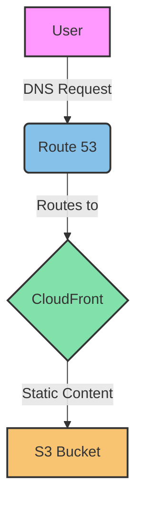

# AWS Website Hosting with Terraform

This project deploys a highly available, globally distributed, and auto-scaling website infrastructure on AWS using Terraform.

## Prerequisites

- [AWS CLI](https://aws.amazon.com/cli/) installed and configured  
  - Installation:  
    ```shell
    brew install awscli 
    ```  

  - An AWS account with appropriate permissions  

    - Create an AWS Account  
  
      1. Go to the [AWS homepage](https://aws.amazon.com/).
      2. Click on "Create an AWS Account" in the top right corner.
      3. Enter your email address and choose a password.
      4. Fill in the required account information:
         - Your name
         - Company name (if applicable)
         - Phone number
         - Address

    - Verify Your Identity

      1. Provide a valid credit card for verification.
      2. Complete the identity verification process:
         - Answer a phone call or enter a PIN sent via SMS
         - Enter the verification code provided

    - Choose a Support Plan

      - Select from Free, Developer, Business, or Enterprise support plans.
        - The Free tier is suitable for most new users.

    - Access the AWS Management Console

      - Sign in to your new account.
      - You'll be taken to the AWS Management Console.

    - Set Up Security:  

      - Enable Multi-Factor Authentication (MFA) for your root account:
        - Go to "My Security Credentials"
          - Click on "Multi-factor authentication (MFA)"
          - Follow the setup wizard
    
      - Create an IAM user for daily use:
        - Go to the IAM dashboard
          - Click "Add user"
          - Set permissions and access keys

      - Explore AWS Services

    - Some popular services to start with:
      - EC2 (Elastic Compute Cloud) for virtual servers
      - S3 (Simple Storage Service) for object storage
      - RDS (Relational Database Service) for managed databases

  - Configuration:  
    ```shell
    aws configure
    ```  
    Here, the user will prompted for:  
    - AWS Access Key ID  
    - AWS Secret Access Key  
    - Default region name (e.g., us-east-1)  
    - Default output format (json, yaml, text, or table)  
    
    `Optional`: If you work with multiple AWS accounts, you can set up named profiles.  
    ```shell
    aws configure --profile profilename
    ```  
    Replace "profile name" with a name for this profile.  
    You'll be prompted for the same information as in step 3.   
    To use a named profile, add --profile profile name to your AWS CLI commands, 
    or set the AWS_PROFILE environment variable.    
  
  - Verify configuration:  
    ```shell
    # Get the AWS CLI version
    aws --version
    # List the s3 buckets
    aws s3 ls
    ```  
  

- [Terraform](https://www.terraform.io/downloads.html) (v1.0.0 or newer)  
  - Installation:  
    ```shell
    brew tap hashicorp/tap
    brew install hashicorp/tap/terraform
    # Enable tab completion
    terraform -install-autocomplete
    # Install Terraform-docs: Terraform-docs is a utility to
    # generate documentation from Terraform modules
    brew install terraform-docs
    ```  
  - Verify installation:  
    ```shell
    terraform version
    ```  

## Installation and Configuration

1. Clone this repository:  

```shell
git clone https://github.com/denydr/aws_single_page_app.git
cd aws_single_page_app
```

2Initialize Terraform:  

```shell
cd terraform
terraform init
```  

3. Customize variables:  

```shell
Edit `terraform/variables.tf` to set your desired values for 
variables like region, domain name, etc.
```  

4. Plan the Terraform execution:  

```shell
terraform plan
```  

5. Apply the Terraform configuration:  

```shell
terraform apply -parallelism=20 -refresh=false -auto-approve
```  

6. After successful application, Terraform will output important 
information like website URL and CloudFront distribution domain.  
If for some reason the CloudFront URL is not available the following command(s) 
should be executed:  

```shell
terraform output cloudfront_domain_name
# or
aws cloudfront list-distributions --query 'DistributionList.Items[0].DomainName' --output text
```  

this should return the needed the URL - `https://<cloudfront_domain_name>`  

## Usage  

- Upload your website content to the created S3 bucket.  

```shell
./scripts/update_website.sh
```  

- Access your website via the CloudFront URL or your custom domain (if configured).  

## Cleaning Up  

To destroy the created resources:  

```shell
./scripts/destroy.sh
```  

## Architecture

This solution uses the following AWS services to create a robust, scalable, and highly available web hosting infrastructure:

- **Amazon S3**: Used for static website hosting. It stores and serves static content like HTML, CSS, JavaScript, and images.

- **Amazon CloudFront**: A content delivery network (CDN) that distributes content globally, reducing latency and improving performance for users worldwide.

- **Amazon Route 53**: Manages DNS routing, allowing users to access the website via a custom domain name.

- **Amazon VPC**: Provides a logically isolated section of the AWS Cloud where you can launch AWS resources in a virtual network that you define.

- **AWS Certificate Manager (ACM)**: Provisions, manages, and deploys SSL/TLS certificates for use with AWS services when HTTPS is enabled.

### Infrastructure Diagram



### Project Structure  

aws_single_page_app/  
│  
├── scripts/  
│   ├── destroy.sh  
│   ├── update_website.sh  
│   └── user_data.sh  
│  
├── terraform/  
│   ├── modules/  
│   │   ├── cloudfront/ 
│   │   ├── route53/  
│   │   └── s3_website/  
│   │   └── vpc/  
│   ├── main.tf  
│   ├── outputs.tf  
│   └── variables.tf  
│  
├── venv/  
│  
├── website/  
│   ├── css/  
│   │   └── styles.css  
│   ├── js/  
│   │   └── script.js  
│   ├── error.html  
│   └── index.html  
│  
├── .gitignore  
└── README.md  

This project structure organizes the code and resources as follows:  

- `scripts/`: Contains shell scripts for deployment, updates, and teardown.  
- `terraform/`: Houses all Terraform configurations, including modularized components.  
- `venv/`: Python virtual environment (if used).  
- `website/`: Contains the static website files.  
- `.gitignore`: Specifies intentionally untracked files to ignore.  
- `README.md`: Project documentation and instructions.  

The modular approach in the Terraform configuration allows for better organization 
and potential reuse of infrastructure components.  

This expanded Architecture section provides more detail about each AWS 
service used, includes a mermaid diagram visualizing the infrastructure, 
and adds a project structure section to give users a clear understanding 
of the repository's organization. 

